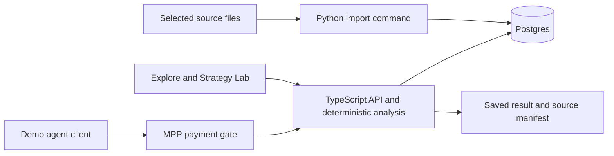

# Verdant AI five hour demo plan

Prepared 3 October 2026, America/Los_Angeles. **Five hours, one builder, investors or hackathon judges.** This is the active plan, amended by [agent requested data](DATA-REQUESTS.md), which takes precedence for the request workflow, worker and revised schedule. The [platform roadmap](PLATFORM-ROADMAP.md) preserves the larger architecture for later work.

Build one impressive working journey across all three pillars: explore normalized climate data, evaluate a supported strategy, and let an agent buy data through MPP. Make it feel like one coherent climate intelligence product. Ground the live scientific execution in the existing Australian grape trial.

The pitch: **Agents request clean climate data in the format they need. Verdant retrieves, preprocesses and serves it, paid through MPP, so agents do not have to process it locally.**

Approved target: Supabase `ulspzrnnwrfbgldphjpe`. Remote SQL inspection found no application tables or installed PostGIS extension. Existing research inputs must be imported. Acquisition uses a logged Pi coding agent with the Claude API; the user will provide the key. Make the request/cache-miss/acquisition flow the central demo and use the map and existing backtest as proof of utility.

## What ships

| Pillar | Working scope | Audience takeaway |
|---|---|---|
| Normalized data | Selected CSIRO outcomes, irrigation records and one SILO raster in Postgres, with units and provenance | Heterogeneous files become consistently usable data |
| Visual workspace | Map, layer selector, exact pixel inspector, irrigation history and treatment charts | The data is understandable and genuinely database-backed |
| Intelligence | Compare observed programs; change economic assumptions; receive a source-linked explanation | Go from a question to an inspectable decision trade-off |
| Paid API | Free catalog, one MPP-protected extraction, runnable client and actual test receipt | External agents can purchase the same normalized data |
| Reproducibility | Saved result ID and JSON/CSV export with source versions and assumptions | Results are inspectable and reproducible |

Do not add new scientific studies until these connect. Broadness comes from the reusable workflow and contracts, not from claiming every dataset supports every decision.

## Four minute presentation

**0:00–0:30 — The problem.** Start inside the product. Show the selected source formats and the consistent metadata inspector they feed. Explain incompatible units, spatial resolutions, dates and assumptions. Use actual available counts and coverage.

**0:30–1:15 — Explore.** Open the Mildura vineyard project. Show the real SILO temperature layer for 1 January 2003 and the trial's approximate published location. Click a cell to fetch its Celsius value, date, resolution and source. Open recorded irrigation and yield evidence.

**1:15–2:30 — Evaluate.** Ask “How did regulated deficit irrigation compare with the control across all three trial years?” Run the calculation and show water savings alongside yield loss. Adjust water value and grape price; show the break-even boundary and changed conditional economics. The compelling moment is seeing when a trade-off changes.

**2:30–3:30 — Sell to an agent.** Execute a client that discovers the data, receives HTTP 402, fulfills an MPP test payment and receives the normalized extraction and receipt. Show the same dataset version used by the workspace. Label the test network.

**3:30–4:00 — Trust and expansion.** Open the evidence drawer and export the result. Explain how the same interfaces extend to other crops, validated action models and regional policy datasets. Clearly identify future capabilities.

## The interface

Build one desktop shell with **Explore, Strategy Lab, Agent API**. Saved runs live inside Strategy Lab. Reuse the project context and evidence drawer everywhere.

- **Explore:** slim catalog rail, large map, compact inspector and bottom chart. Start at the trial region. Show only actual layers, dates and coverage; a one-date raster cannot have a fictional time slider.
- **Strategy Lab:** prominent prompt with examples, editable comparison/economic inputs, three headline metrics, all-year chart, break-even chart and citations. Label the result “Observed program replay.” Execution events reflect real tool calls.
- **Agent API:** catalog, bounded request builder, copyable client code, quote/challenge, live transaction events, response and receipt. Keep protocol detail in an expandable panel.

Visual direction: warm neutral surfaces, forest-green navigation, clear typography, restrained amber qualifications, generous chart space and consistent units. Prioritize the first loaded screen, transitions and result view. Handle loading, errors and retry. Desktop presentation quality comes before mobile refinements.

## Minimum architecture

Use Next.js/TypeScript for the app and API, MapLibre for the map, a familiar chart library and Python for one-time ingestion. Reuse an accessible Supabase/Postgres environment without resetting existing data or services. Pin compatible versions once.

The small treatment comparison can run synchronously in the API and save its inputs/result. Check its numerical parity against the existing Python runner. Acquisition requires a durable Postgres job and one polling Pi worker as specified in DATA-REQUESTS.md. Defer a general queue service, accounts, organizations and a generic model runner.

Limit application tables to `dataset_versions`, `observations`, `raster_tiles`, `analysis_runs` and `payment_operations`, with validated source-specific configuration in structured JSON. Keep privileged DB access on the server and expose only selected published demo data. Do not expose the private research schema.

Human demo browsing has an explicit free entitlement. Charge for a documented bounded extraction, not every map request. Private or paid data must not be accessible through an unprotected direct database route.

## Data and evidence

Source package: `/Users/kevinloo/projects/supabase-hackathon/handoff/agriculture-demo-2026-10-02/`.

1. **CSIRO:** reuse `workspace/research/perennial-backtest/grape/normalized-inputs.json`, source irrigation records and the existing runner/results. Preserve all nine treatment-year outcomes from 2003–2005 and complete management histories. Compare persistent programs; do not select each year's winner after seeing the harvest.
2. **SILO:** import the already acquired 1 January 2003 temperature raster. Store bounded float arrays with grid metadata and null semantics. Render a regional crop fetched from Postgres, enforcing cell and byte limits. Do not download a new archive during the sprint.
3. **Location:** use the approximate trial marker at −34.416667, 142.35 with the qualification from `workspace/research/demo-datasets/grape/csiro-spatial-receipt.json`. Distinguish weather stations from the trial; no invented field boundary.
4. **Metadata:** retain source URL/DOI, source hash, units, date/period, spatial support, observation/interpolation status, dataset version, license/attribution and assumptions. Review the selected assets' permitted use before serving them.

The historical replay reports average regulated-deficit water savings of 537.33 m³/ha/year and yield reduction of 986.67 kg/ha/year versus control. These are reference checks after reproduction, not hardcoded cards. Economic inputs are hypothetical. The raster provides context; it did not generate the observed treatment effects.

During planning, all 270,901 manifest entries passed file existence/size checks, and six selected input/result/receipt files matched their SHA-256 hashes. The full archive was not rehashed; current database availability and hosted application behavior remain unverified.

## Intelligence and API

Implement four typed tools: `find_datasets`, `describe_dataset`, `compare_programs`, and `calculate_economics`. If an LLM credential is available, use it to map prompts to this schema and explain returned numbers with citations. Calculations always execute in code. If model access is unavailable, the structured strategy form still works; label it as a template rather than pretending scripted text is live AI.

For each year, calculate change in partial margin as yield difference × grape price + water saved × water value − additional cost, with explicitly equal quality prices. Show components, all years and the equal-year mean. Retain quality indicators separately. Handle undefined break-even cases explicitly.

The first strategy language compares observed programs under explicit assumptions. It cannot infer yields from unobserved watering schedules. Unsupported questions should identify the missing data/model and offer a supported comparison. “Any strategy” becomes a future extensible interface with validated domain-model adapters.

Minimal routes:

- `GET /api/v1/datasets`: free metadata, coverage, versions and supported operations.
- `GET /api/v1/layers/{id}` and `/sample`: bounded map values and exact inspection.
- `POST /api/v1/compare`: validated study/program/economic inputs; returns a saved result.
- `GET /api/v1/runs/{id}`: result, assumptions and source versions; JSON/CSV export.
- `POST /api/v1/extract`: MPP-protected bounded extraction tied to a dataset version.

## MPP integration

Use the [mppx TypeScript SDK](https://github.com/wevm/mppx) and [MPP specification](https://github.com/tempoxyz/mpp-specs). The documented flow is challenge → credential → verification → data and receipt. Proposed default: one-time charges in a supported Tempo test environment. Verify the rail, credentials and a test exchange immediately.

Bind each logical purchase to its dataset version and canonical request digest. Save payment reference and fulfillment result. Retrying an authorized operation retrieves the same result; a changed query cannot reuse its entitlement. Verify the SDK's settlement/retry behavior rather than assuming a DB uniqueness constraint prevents duplicate settlement. Reconcile an ambiguous outcome before trying another charge.

Keep signing keys outside the browser and model; enforce a small test budget. Show the actual network and receipt. Test unpaid 402, a completed purchase and repeated-request recovery. Prices are demo settings until costs are measured. Do not describe a simulated receipt as a settled payment.

## Original schedule before the acquisition scope addition

Use the revised five-hour priorities in DATA-REQUESTS.md. This original breakdown is retained as a reference for individual UI and analysis tasks; it is not an additional five hours.

| Elapsed time | Work | Checkpoint |
|---|---|---|
| 00:00–00:20 | Verify DB/files; scaffold app; spike MPP test request; confirm model access and presentation environment | DB works; payment/model status is explicit |
| 00:20–01:00 | Import trial/regional raster; implement bounded reads and economics | One actual pixel and one comparison returned through API |
| 01:00–02:15 | Build polished shell, map/inspector, trial charts and Strategy Lab | Clickable data → display → comparison journey |
| 02:15–03:00 | Economic controls, break-even chart, evidence, typed prompt tools, saved run/export | A changed assumption changes a calculated result |
| 03:00–03:40 | Integrate paid extraction/client and Agent API panel | Actual test payment → data → receipt |
| 03:40–04:20 | Verify numerical/display parity, all-year results, missingness, payment retry; fix browser/layout failures | All three pillars work together |
| 04:20–05:00 | Freeze features; validate presentation environment; rehearse twice; record walkthrough; document launch/seed commands | Repeatable four-minute demo and labeled recording fallback |

This is an aggressive execution budget, not a guarantee. The source data and research reduce the scientific work; credentials, runtime availability and payment setup remain schedule risks. Cut features rather than integration testing or rehearsal.

## Cut order and contingencies

**Preserve:** database-backed map, observed comparison, economic slider, evidence, MPP integration and a clean presentation path.

**Cut first:** more datasets, map animation, full chat history, general strategy builder, teams, PDF generation, automated source refresh, pgvector, custom crop models, infrastructure abstraction, mobile refinements and a separate marketing site.

- **DB blocked at 20 minutes:** use an isolated local Postgres if the installed runtime supports it; never reset the existing stack. If no DB can run, disclose the storage blocker. A JSON-only UI is a labeled prototype, not the requested database-backed demo.
- **Payments blocked at 20 minutes:** allow at most 15 additional minutes before returning to the core UI. Preserve the challenge and SDK client, track settlement as blocked, and revisit during the integration slot. A visible pending integration or recording is not a successful live payment.
- **Model unavailable:** ship the functional typed strategy template and calculated evidence-backed result, without claiming live natural-language execution.
- **Hosting unavailable:** present the real local app. Deploy only when the selected account/environment is usable and the integration is ready before the final 40 minutes. Last-minute hosting setup is not a dependency of the presentation.
- **Venue connectivity fails:** show a clearly labeled recording of a real run. Never silently substitute fake live data or events.

## Demo acceptance

1. One pixel and one observation match source/DB/API/display, including units, versions and null semantics.
2. The three-year comparison agrees with the reference runner. Assumption changes execute the declared economics and retain negative years.
3. An actual MPP test purchase returns the extraction and receipt; repeating the operation recovers it without another logical purchase. Disclose this pillar as incomplete if blocked.
4. No DB service key or signing key reaches the browser. Invalid inputs and failed requests have clear error states.
5. Every visible count, status, metric and source link reflects implemented behavior; future capabilities are clearly identified.
6. The presentation completes twice consecutively and a recording exists before the sprint ends.

Position this as the working foundation of a broad climate decision platform. Demonstrate the three pillars with one credible decision. Describe irrigation, pruning and policy according to what is actually implemented; a treatment replay does not validate arbitrary strategies or forecast farmer profit.

If BetterStack logs are needed, use SQL API connections only. Browser/UI queries and UI fallbacks are prohibited by standing user instruction.
