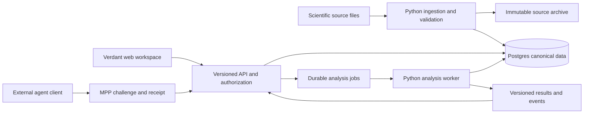

# Verdant AI platform roadmap

Prepared 3 October 2026, America/Los_Angeles. Longer-term architecture reference. The active five-hour demo plan is [BUILD-PLAN.md](BUILD-PLAN.md), amended by [agent requested data](DATA-REQUESTS.md). The approved acquisition scope uses a logged Pi coding agent with Claude API access and Supabase project `ulspzrnnwrfbgldphjpe`. Product implementation has not started in this repository.

Build Verdant as a climate decision workspace backed by a versioned data API. A person or agent should be able to find compatible data, inspect its meaning, evaluate a supported strategy, and obtain a reproducible result with sources and costs attached. The first polished demo should complete that whole journey for Australian grape irrigation.

The product promise is **climate data that agents can understand, purchase, and use to evaluate decisions**. Normalization must preserve the differences that matter: measurement versus forecast, spatial support, units, uncertainty, study design, and what information existed when a decision was made.

The actual constraint is five hours, one builder, and an investor or hackathon-judge audience. The broader architecture and 10–15 working-day sequence below describe follow-on work with two engineers; they are not the active demo commitment. Deployment destination and payment rail remain open. No deployment or payment has been performed as part of planning.

## Starting position

The Verdant directory was empty when inspected. The evidence package is at `/Users/kevinloo/projects/supabase-hackathon/handoff/agriculture-demo-2026-10-02/`.

| Asset | Actual readiness | Build decision |
|---|---|---|
| CSIRO Cabernet irrigation | Nine treatment-year means across three persistent programs, 2003–2005; normalized outcomes and recorded irrigation schedules | Primary decision story |
| SILO temperature raster | One real GeoTIFF for 1 January 2003, decoded locally; 841 × 681 cells; not yet an application DB layer | Primary map layer; explicitly one date initially |
| Trial geography | Approximate published location, −34.416667, 142.35; no verified plot boundary | Show an approximate trial marker, separately from weather-station coordinates |
| Economic research | Seven perennial study replays and 6,184 sensitivity cases; saved SQL/Python verification receipts | Reuse formulas and source lineage; independently verify imported inputs |
| Database storage | Historical local array roundtrip and private research-schema results | Build an isolated application schema; do not expose the research schema |
| App and APIs | Proposed contracts exist; browser rendering and deployed endpoints do not | Build the complete serving and interaction path |
| Crop simulation | VineLOGIC source exists; valid arbitrary-farm simulation is unestablished | Defer adaptive irrigation and arbitrary-farm yield claims |
| pgvector | Bounded local NOAA benchmarks exist | Optional later feature, conditional on a useful similarity question |

Planning inspection checked file existence and sizes for all 270,901 manifest entries, with no mismatches, plus SHA-256 for six selected input/result/receipt files, all matching. It did not hash the full archive, query the current database, rerun the scientific studies, or validate a hosted deployment.

## The first demo

Open a finished workspace titled **Mildura vineyard irrigation**. The central question is: “How much water did these irrigation programs save, what happened to yield, and under which prices would the trade-off be worthwhile?”

1. **Explore.** Open the Australian climate map, inspect a SILO temperature cell, and see its date, Celsius value, spatial resolution, interpolation status, and source. The displayed value comes from Postgres through the product API.
2. **Inspect evidence.** Select the approximate trial marker. View the three irrigation programs, management histories, and all three observed harvest years. Weather provides context; the UI does not imply that this raster generated the treatment effects.
3. **Ask.** Enter “Compare regulated deficit irrigation with the control across all trial years.” The assistant selects the admitted study and proposes a structured comparison with a baseline and explicit assumptions.
4. **Run.** Execute the comparison from stored observations. Show water, yield, quality indicators, and conditional partial-margin components side by side, including unfavorable years.
5. **Explore the decision.** Adjust water value, grape price, and additional operating cost. Update the calculation and show the break-even water value. Distinguish user assumptions from measured quantities.
6. **Show agent access.** Switch to an agent activity panel. An external demo client discovers the dataset, receives a payment quote/challenge, pays through MPP in the selected test environment, and receives the versioned result and receipt. Display the same dataset version and result identifiers as the web app.
7. **Leave with a result.** Save a read-only result link and download the input assumptions, tabular results, source references, and run manifest.

The existing replay reports an equal-year mean saving of 537.33 m³/ha/year and a mean yield reduction of 986.67 kg/ha/year for regulated deficit irrigation versus control. Use these as acceptance references after reproduction, not hardcoded dashboard output. They do not establish increased farm profit. See the package's `POSITIVE-OUTCOMES.md` and grape report.

Target presentation length: 4–5 minutes. The memorable moment is changing a cost assumption and seeing why the preferred program changes, then opening the evidence and API receipt behind the result.

## Product surfaces and visual direction

Use a cohesive desktop workspace with four destinations: **Explore, Strategies, Runs, API**. Open directly into a useful saved project. Keep the selected study, dates, and dataset versions consistent across destinations.

| Surface | Required interaction | Polish requirement |
|---|---|---|
| Explore | Layer catalog, actual coverage, map, pixel inspector, series chart, source details | Useful first viewport; clear legend and units; disabled dates when unavailable; no fictional farm boundaries |
| Strategies | Natural-language request and editable structured specification; program and baseline selectors; economic inputs | Suggested questions; human-readable plan before execution; clear unsupported-strategy explanation |
| Runs | Progress, results, all-year comparisons, assumptions, evidence drawer, saved history | Aligned charts and units; visible trade-offs; readable export; stable URL |
| API | Catalog and pricing, request builder, runnable client example, response and payment receipt | One working paid request; copyable code; actual request status and latency |

Visual direction: warm neutral backgrounds, forest-green navigation and accents, restrained amber for quality limitations, generous chart space, consistent typography and number formatting. Make the map and decision comparison the main visual elements. Use a color-accessible scale and show missingness explicitly. Put citations and technical provenance in a one-click evidence drawer while keeping essential qualifications next to the result.

The assistant lives beside the workspace and can change its state through typed tools. It should expose actions and evidence, such as “Loaded three seasons” or “Calculated water-value break-even,” rather than fabricated reasoning or progress. Provide useful loading, empty, error, retry, and interrupted-run states. Support keyboard operation, visible focus, and common laptop viewport sizes.

## Data normalization and storage

Use Postgres as the canonical query and result store. Retain immutable source files in object storage with hashes and access terms; store normalized tabular values and bounded raster arrays in Postgres. Keeping original files outside Postgres does not replace the canonical normalized data with file-only access.

### Canonical contract

Every published dataset version must declare:

- Source organization, URL or DOI, original file/member/row selector, checksum, retrieval time, version, attribution, and allowed redistribution/use.
- Variable identity, physical quantity, original and normalized units, conversion rule, aggregation meaning, and precision.
- Geometry or grid, CRS, affine transform where relevant, spatial resolution, and whether support is a point, pixel, plot, farm, or region.
- Observation time or date interval, timezone/calendar, forecast issue time where relevant, first-known availability, and ingestion time. Unknown availability remains unknown; ingestion today cannot establish historical availability.
- Evidence class: observation, interpolated observation, forecast, model simulation, published aggregate, or user assumption.
- Missingness, quality flags, uncertainty when supplied, study/site/cohort/treatment identifiers, and assignment or aggregation grain.
- Versioned transformations and join/resampling decisions. Retain the original values alongside conversions or in immutable source references.

Normalization does not silently equate rainfall with irrigation, air temperature with canopy temperature, or a regional pixel with a farm measurement. It must not invent annual outcomes from multiyear means. Mark incompatible joins and unsupported comparisons before execution.

### Application tables

| Group | Proposed tables | Purpose |
|---|---|---|
| Catalog | `sources`, `source_assets`, `dataset_versions`, `variables`, `ingestion_runs` | Discoverability, licenses, transforms, validation and publication state |
| Geography | `sites`, `spatial_units`, `grids` | Explicit spatial roles and source-to-map transforms |
| Measurements | `observations`, `raster_tiles` | Typed measurements and bounded arrays with missingness |
| Evidence | `studies`, `treatments`, `management_events`, `outcomes` | Preserve experimental meaning and treatment history |
| Analysis | `strategy_versions`, `analysis_runs`, `run_inputs`, `run_results`, `run_events` | Immutable specifications, deterministic replay, progress and lineage |
| Access | `workspaces`, `memberships`, `quotes`, `entitlements`, `payment_attempts`, `usage_events` | Tenant access, payment reconciliation and metering |

Put core identities, units, dates, values, and query fields in typed columns. Use JSONB for source-specific extensions and structured specifications. Index common site/variable/time/version reads and spatial lookups. Start with measured workload sizes; add partitioning when query plans and volume justify it.

For the first raster importer, decode outside Postgres and write tiles of at most 256 × 256 nullable float32 values with dimensions, transform, source hash, date, units, and validity semantics. Verify float32 fidelity. Use a bounded binary or bounded JSON transport; enforce both cell and byte limits, subdividing JSON payloads if necessary. Never treat a missing cell as zero.

Serve rendered map tiles derived from the stored arrays, with an exact numeric inspection endpoint using the same dataset version. Cache keys include dataset version and render style. Screen reprojection and color mapping must not change the reported source-cell value.

Ingestion sequence: acquire and checksum → decode → validate metadata and values → load staging → compare counts/masks/sample values → publish one immutable version. Failed loads remain unpublished. Repeated imports are idempotent; later corrections create a new version. A small operator CLI is sufficient initially.

## Architecture

Proposed stack: TypeScript/React with Next.js for the web app and API gateway; MapLibre for maps; Python for ingestion and scientific computation; Supabase Postgres with PostGIS for geography; object storage for originals and exports. Keep the browser and external clients on the same analytical contracts. Long-running analysis executes in a worker with durable Postgres job state, leases, bounded retries, and cancellation, outside web request lifetimes.

These choices reuse the research language while allowing one TypeScript payment boundary. Next.js documents [route handlers](https://nextjs.org/docs/app/getting-started/route-handlers), MapLibre supports [raster sources](https://maplibre.org/maplibre-gl-js/docs/examples/map-tiles/), and PostGIS supports [indexed spatial queries](https://postgis.net/documentation/faq/spatial-indexes/). Pin actual package versions during the first implementation spike.

Suggested layout: `apps/web`, `packages/contracts`, `packages/api`, `services/worker`, `pipelines`, `db/migrations`, `examples/agent`, and `tests/e2e`. Extract shared modules only where the web app, agent example, or worker actually share a contract. No microservice fleet is needed for the demo.

## API and MPP payments

| Contract | First-release behavior |
|---|---|
| `GET /v1/datasets` and `GET /v1/datasets/{id}` | Free catalog, coverage, variables, version, evidence class, license, supported operations and pricing |
| `POST /v1/quotes` | Validate and price a bounded data extraction or analysis; freeze parameters and dataset versions |
| `POST /v1/queries` | Execute or enqueue a quoted extraction after authorization/payment; return result or durable job ID |
| `GET /v1/queries/{id}` | Authorized status/result retrieval with stable pagination; no second purchase for the same entitlement |
| `GET /v1/layers/{id}/tiles/...` and `/sample` | Version-pinned map rendering and exact source-cell inspection |
| `POST /v1/runs` | Submit an admitted strategy specification and return a durable analysis ID |
| `GET /v1/runs/{id}` and `/events` | Status, results, assumptions, provenance, and actual execution events |
| `GET /v1/runs/{id}/export` | Authorized result bundle with specification, data references, and hashes |

Publish OpenAPI and a small runnable agent client. Parameters are typed and bounded; do not expose arbitrary SQL. Responses carry dataset version, source references, units, quality/coverage, assumptions, classification, cursor, and run/query IDs. Include structured errors for insufficient coverage, incompatible units, unavailable evidence, payment failure, and expired quote.

MPP means Machine Payments Protocol. Its documented exchange is an HTTP 402 challenge, client payment credential, validated resource access, and receipt. Use the maintained [mppx TypeScript SDK](https://github.com/wevm/mppx) against the [MPP specification](https://github.com/tempoxyz/mpp-specs); confirm the chosen method's retry and settlement behavior in a day-one spike. Proposed demo default: one-time charges on Tempo testnet, clearly labeled. The rail is a configurable choice, not a scientific or product dependency.

Product rules:

- Keep dataset discovery, coverage, licensing, and quote inspection free. Charge for a bounded normalized extraction and, separately if needed, a bounded analysis. Human workspace access can have an explicit bundled/demo entitlement.
- Price the completed logical operation, not every browser tile, status poll, or network retry. Quote in a declared currency with expiry and explicit resource limits. Determine actual rates after measuring query and compute costs.
- Bind the quote and entitlement to the canonical request digest and immutable dataset versions. A changed query requires a new quote.
- Persist settlement/credential references and fulfillment state. An idempotency key and transactional uniqueness prevent duplicate job creation and duplicate application fulfillment; they do not by themselves guarantee payment-rail settlement semantics.
- Reconcile ambiguous payment outcomes before retrying a charge. A payment followed by worker failure must remain recoverable through the same entitlement, or enter a documented refund/credit path.
- Enforce agent spend and compute limits in code. Keep signing keys outside the model and browser. Show test/live status and the actual receipt, without displaying secrets.
- Test concurrent retries, expired challenges, invalid credentials, insufficient funds, paid-but-interrupted delivery, and direct unpaid access to supposedly paid data.

Provide a real test-environment exchange for the demo; label any recorded fallback as a recording. Never represent a simulated receipt as a settled payment.

## Intelligence and strategy evaluation

The language model translates intent into a typed plan, finds admissible evidence, invokes deterministic tools, and explains the returned results with citations. Calculation and admission rules live in code. Tool sequence: discover → inspect metadata → check compatibility → construct specification → quote → execute → summarize. The result must remain reproducible without asking the model to repeat its reasoning.

A strategy specification contains an objective, study/site, action set, baseline, decision frequency, information cutoff, input versions, model or replay method, evaluation period, economic assumptions, constraints, metrics, and budget. Store the validated specification before a run. Treat source-document text as evidence, never tool authorization.

| Evaluation mode | Meaning | Delivery |
|---|---|---|
| Observed program comparison | Replay complete, observed persistent treatment programs and their outcomes | First release |
| Economic sensitivity | Revalue the same outcomes under explicit water, crop, quality and cost assumptions | First release |
| Historical decision backtest | Apply frozen rules using only information available before each decision; score supported outcomes | Later, per admitted strategy and dataset |
| Model-based counterfactual | Estimate an unobserved action using a calibrated, validated domain model | Later, labeled model output |

For the CSIRO comparison, retain all three years and all three programs. Do not choose each year's winning treatment after observing harvest. Full irrigation histories and postharvest water remain part of the comparison. A mean treatment table does not identify the effect of switching programs or irrigating a new amount tomorrow.

For equal-price irrigation sensitivity, calculate per-year change in partial margin as `(alternative yield − baseline yield) × grape price + (baseline irrigation − alternative irrigation) × water value − additional cost`. Show each component and then the disclosed equal-year mean. Keep currency and per-hectare units explicit. If quality prices differ, use a separately declared valuation formula; missing quality valuation is an exclusion, not observed zero impact. Return an undefined break-even when its mathematical conditions do not hold.

General backtesting later needs decision-time availability, lag-aware features, chronological development/evaluation splits, frozen transformations, realistic action constraints, competent baselines, transaction/operating costs, and uncertainty appropriate to independent units. Climate observations alone cannot identify the causal response to a new action. “Any strategy” should mean an extensible strategy interface with explicit support requirements, not automatic scientific validity.

For later user-supplied models, require a versioned adapter contract for inputs, actions, state transition, outcomes and validation evidence. Run custom code in an isolated environment with time, memory and network limits. Defer arbitrary code execution from the initial UI.

## Build sequence and completion gates

Calendar ranges overlap where work can proceed independently. The critical path is source contract → canonical ingestion → API → rendered values → analysis results → integrated demo. Spike payments early so a rail integration problem does not appear at the end.

| Milestone | Estimate with two engineers | Deliverable and completion gate |
|---|---|---|
| 0. Freeze the story and prove risky integrations | Day 1 | Select exact assets and permitted uses; confirm geography; reproduce one economic result; complete one MPP test charge; freeze API and design skeleton |
| 1. First database-backed screen | Days 2–3 | Isolated migrations, manifest-driven CSIRO and SILO import, one published version, bounded API, map cell inspector; source → DB → API → tooltip equality |
| 2. Decision comparison | Days 4–6 | Python worker, complete observed-program replay, assumptions editor, all-year charts, component economics, saved run; parity with the research reference |
| 3. Agent and paid access | Days 5–8 | Typed assistant tools, quotes, protected extraction, entitlement recovery, example agent, receipts and trace; a paid client receives the same versioned data used by the app |
| 4. Product finish | Days 8–11 | Cohesive four-destination UI, result links/export, loading/error/empty states, accessible charts, coverage warnings, durable job recovery |
| 5. Deployment rehearsal and buffer | Days 12–15 | Selected demo environment, smoke checks, timing measurements, payment failure rehearsal, clean seed/recovery procedure, recorded walkthrough and final script |

A solo engineer should budget roughly 4–6 weeks for comparable polish, depending on payment and hosting familiarity. Re-estimate after milestone 0. The plan does not assume that preexisting research receipts prove a working hosted application.

If the deadline is 48–72 hours, retain one study, one raster date, one observed comparison, economic sliders, an evidence drawer, and one paid API request. Use a single workspace and fixed strategy template. Remove general chat, custom strategy rules, broad ingestion, extra crops, team administration, and pgvector. A short sprint can demonstrate the pipeline but has much less operational hardening.

## Demo acceptance

The following are release gates, not claims of current behavior:

1. A selected source cell, source observation and economic result match their database record, API response and displayed value, including IDs, version, units and missingness. Test row/column orientation and SQL/browser indexing.
2. All published source versions have lineage, license/attribution, coverage and validation status. Invalid versions remain unpublished. Preserve separation of trial, station, and grid locations.
3. The complete three-year comparison reproduces the reference within documented precision. New slider values execute the same formula against stored endpoints. Unsupported outcomes return an explanation rather than zero or invented data.
4. Catalog, API, assistant and UI agree about dataset versions and supported operations. Pagination retrieves all eligible rows without duplication or hidden truncation.
5. The external client completes an actual MPP test exchange. Retries do not trigger another logical purchase; malformed/expired credentials fail; settled-but-undelivered work can be recovered.
6. Private/unpublished data and other workspaces' runs are inaccessible. Payment-gated routes cannot be bypassed through an exposed database endpoint. No privileged database or wallet credentials reach the browser.
7. Worker interruption, source/API failure and payment failure have clear recovery states. A network failure never silently substitutes embedded sample results.
8. Proposed performance budgets on the chosen demo environment: usable workspace within 3 seconds, selected-cell response within 500 ms at p95, economic recomputation within 1 second at p95, and a small study replay within 10 seconds. Measure cold/warm behavior and end-to-end timing separately from database execution; tune or revise budgets from evidence.
9. Rehearse the full script repeatedly from a clean application state. Include at least one negative year and one changed assumption. Keep a clearly labeled recorded walkthrough available for venue connectivity problems.

Use focused importer/contract tests, independent SQL/Python numerical parity, payment failure/recovery integration tests, tenant-access tests, and a browser E2E test for the complete path. Capture screenshots at laptop and presentation sizes. Treat empty states and failure recovery as part of product polish.

Operational events should include request, dataset version, run and payment-correlation IDs without secrets. If BetterStack is used, all log queries must use its SQL API connections; browser/UI log queries and UI fallbacks are prohibited by standing user instruction.

## Expansion after the demo

1. **Data platform:** add more dates/variables for the Australian context, then reusable NetCDF, GeoTIFF, CSV and workbook adapters, automated refreshes, version diffs, coverage/quality reporting, usage quotas and measured pricing.
2. **More supported decisions:** admit almond deficit irrigation and grape pruning as separate studies with their own units, endpoints, periods and economics. Reuse the workspace and analysis contracts without transferring effects across sites.
3. **Historical decision backtests:** add archived forecasts and one supported decision problem with information cutoffs and chronological evaluation. Evaluate the existing NWS cost-loss work as a candidate; its modeled expense reduction is not observed crop-profit improvement.
4. **Validated counterfactual models:** introduce a crop model only after leakage correction, runtime support, calibration and independent evaluation. Add strategy search under held-out validation and explicit budgets.
5. **Policy analysis:** add administrative boundaries, population/land-use exposure, scenario ensembles, regional aggregation and distributional outcomes. Policies require their own outcome/causal models; scaling a farm treatment effect by regional area is not sufficient.
6. **Optional numerical similarity:** use pgvector for a defined climate-analog retrieval task once multiple aligned profiles exist. Define a past-only feature transform, exact baseline and recall threshold before adding an approximate index. Keep this separate from document retrieval and causal treatment evidence.

The durable advantage is the combination of normalized data, preserved meaning, admissible analysis and reproducible paid access. Each new dataset or strategy should extend these contracts rather than add a disconnected dashboard.

## Implementation references

Read these in the source package before importing code or data:

- `POSITIVE-OUTCOMES.md`: supported claims and exact comparators.
- `DATASETS-AND-METHODS.md`: source-to-artifact map and evidence constraints.
- `ARRAY-STORAGE.md`: actual storage types and boundaries of the existing proofs.
- `RUNBOOK.md`: environments and non-destructive reproduction instructions.
- `workspace/research/demo-datasets/README.md` and `grape.md`: primary dataset choice and spatial qualification.
- `workspace/research/perennial-backtest/grape/normalized-inputs.json`, `results.json`, `run.py` and `REPORT.md`: canonical comparison inputs, implementation and interpretation.
- `workspace/research/perennial-backtest/BUILD-SPEC.md` and `API-CONTRACT.md`: prior proposed contracts to adapt; neither is evidence of deployed endpoints.

Preserve the research package and existing Supabase stack. Import the selected assets into the new application deliberately; do not copy the entire archive into the product, reset shared services, or treat the private audit schema as a public API.
